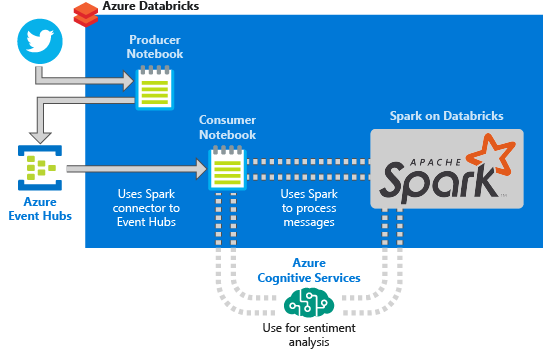

# Sentiment analysis on streaming data using Azure Databricks

In this tutorial, you learn how to run sentiment analysis on a stream of data using Azure Databricks in near real time. You set up data ingestion system using Azure Event Hubs. You consume the messages from Event Hubs into Azure Databricks using the Spark Event Hubs connector. Finally, you use Cognitive Service APIs to run sentiment analysis on the streamed data.

Please visit here to check step-by-step guidance > https://docs.microsoft.com/en-us/azure/databricks/scenarios/databricks-sentiment-analysis-cognitive-services
